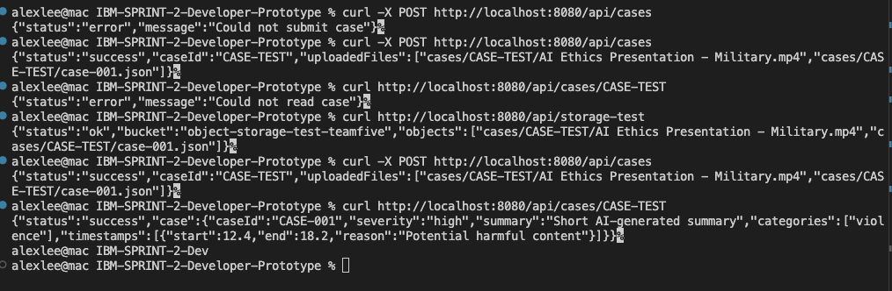
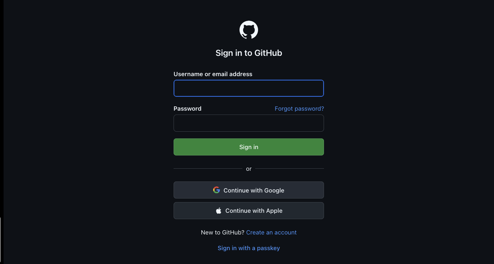
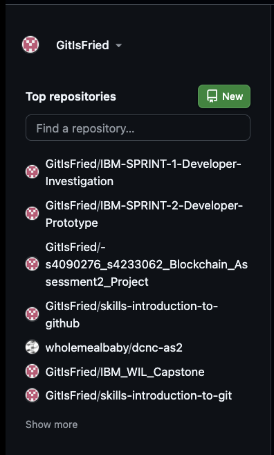
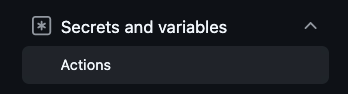
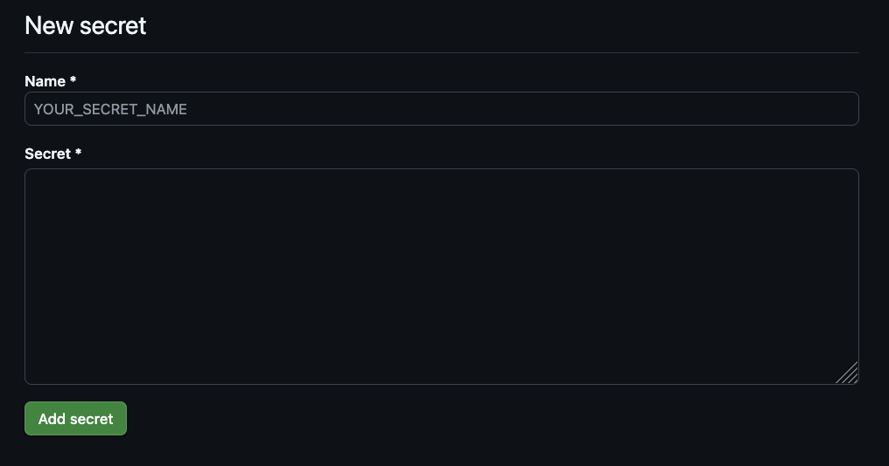

# Introduction
This documentation showcases how Dev1 has implemented a working backend API, case creation and tracking, receiving and validating user input from frontend API, and sharing findings to Dev2 and PM.

# Agreed Minimum Metadata Accepted
The acceptable minimu, metadata accepted from the user is going to be.
- UserID
- Case Video
- Case Audio
- (Optional) User description on why the submitted media is concerning or a multiple choice on why it's concerning.

Current implementation has the case organised in the following:
CASE-TEST-001                Case file
├── [media].[media_format]   The video + audio with its file format(tested with .mp4)
├── transcript.json          Stores the transcript in this format: { "transcript": "...", "confidence": 0.92 }
└── [case].json              The case json that stores caseID, severity, summary, categories and timestamps in this format below:dssd
```
{
  "caseId": "CASE-001",
  "severity": "high",
  "summary": "Short AI-generated summary",
  "categories": ["violence"],
  "timestamps": [{"start": 12.4, "end": 18.2, "reason": "Potential harmful content"}]
}
```

# Create-Case Endpoint Implementation
The create-case endpoint implementation will follow the specified "Public User Submission" flow designed by the UX member Harneet Kaur. To summarise, it's:
Start -> Selected / Submit approved content -> Submission received -> Case created -> Case ID displayed. This is shown in the code via these files.

1. "server.js": Is the main .js that handles all inputs from the frontend(when fully implemented).
2. "case.js": Receives inputs / requests from "server.js" to submit / read cases.
3. "config.js": Handles dependencies from reading .env file
4. "package.json" + "package-lock.json": Handles dependencies localhost

# Unique Case ID generation Implementaion
Implementing the Unique CaseID generation specified by Dev2 Kai Lek Kum, format being: "CASE-XXX". This is conducted during the Create-case Endpoint flow where file "case.js", function "submitCase()" first checks the IBM Cloud Object Storage server how many cases are already storred.

Basic counting system.
# Case ID Returned to Caller Documentation
This documentation is based on the last part of the "Public User Submission" flow: Case ID displayed. It will show the basic necessary information to the user who has submitted the concerning case, including:
- CaseID: "CASE-001"
- Review Status: [AI review, Auditor review, final status[ok, banned]]
- AI severity / Human severity : [low, medium, high]
- Summary: ["This is a test message"]
- Categories: "Test"

This is done in "case.js", function "readCase()", where it reads and outputs the format in the raw format.

# Retrieve-Case Endpoint Implementation
The create-case endpoint implementation will follow the specified "Auditor Review" and "Manager / Supervisor Oversignt" flow designed by the UX member Harneet Kaur. To summarise, it's:
- Auditor Review flow: Access case -> View pre-exposure information -> Review severity / summary / timestamps -> Choose whether targeted media review is needed -> View necessary content(if needed) -> Make final human decision
- Manager / Supervisor Oversignt flow: Access oversight view -> Review relevant case status -> Review Auditor workload -> Review wellbeing information -> Identify concerns / follow-up. 

This is done in "case.js", function "readCase()", where it reads and outputs the format in the raw format.

# Basic Input Validation Implemented
This will cover how the application will be protected from attempted user SQL injectiions, XSS injections and other known phishing and cyber attacks to ensure the security of the application. This will not cover the implementatipn of the frontend API as that is work reserved for the third sprint, however to test for Input Validation, a basic frontend will be created for Input Validation, and is shown below:

Not fully implemented yet, but is conductable in terminal as shown below:


# Expected Error Responses Implemented
Expected Errors are listed below with their responses, and proof of implementation. All error handling will already be recorded and logged, therefore the response and implementation columns will only cover the error's unique response.

| Expected Error | Response | Implementation |
| --- | --- | --- |
| Unknown / Unexpected Error | Direct users to a "fallback interface" and ask them to log back into the website / application | 67 |

Code formatting(currently in each individual .js file but for better code readability will be reorganised into a specialsed .js file, frontend: f_Error.js; backend: b_Error.js )

Current example of error response and formatting, is initiated when connection fails for example:
```
 catch (error) {
        console.error("An error has occurred", error);

        res.status(500).json({
            status: "error",
            message: "Insert message in here"
        });
    }
```

# API Request and Response Format Documentation
Speficied from Dev2 Json formatting

# No Credentials / Secrets Commited
To ensure that no credentials, secrets, API keys are compromised with github commits, this project is created with .gitignore file. There, the .env file where all the api keys are storred will not be commited to github at all. Furthermore the github project will be private. This is done with both .env and .gitignore for localhost, and GitHub repo.

Steps for localhost: In .gitignore, ignore all environment variables and secrets, node.js dependencies and npm logs(just incase) as below, this is to prevent important secrets from being commited to github:
```
# Environment variables / secrets
.env
.env.*
!.env.example

# Node.js dependencies
node_modules/

# npm logs
npm-debug.log*
yarn-debug.log*
yarn-error.log*
pnpm-debug.log*
```

Steps for GitHub + actual project: 
| Log into Github console --> | Head into the private repository "IBM-SPRINT-2-Developer-Prototype" --> | Repository "Settings" --> | "Secrets and Variables" --> "Actions" --> | "New repository secret" --> | Add important API keys such as "IBM_CLOUD_API_KEY" Generated from IBM Cloud Console --> IAM. | 
| --- | --- | --- | --- | --- | --- | 
|  |  |  |  |  |  |

Now API keys and secrets are storred in an encrypted cloud on GitHub.