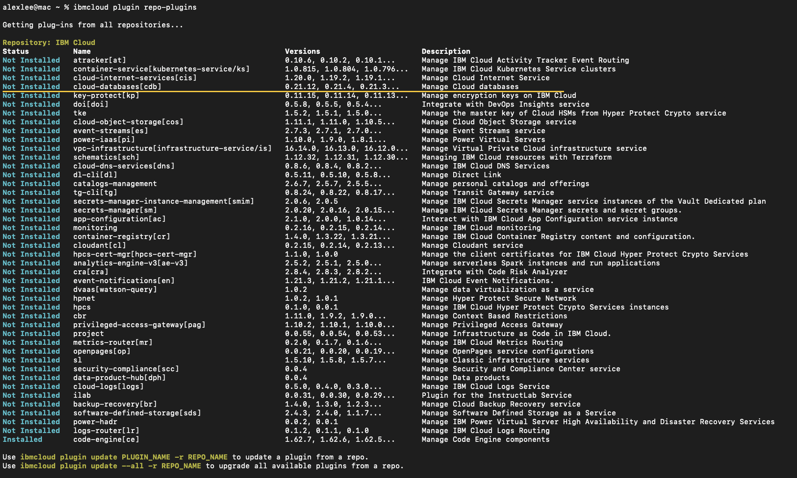
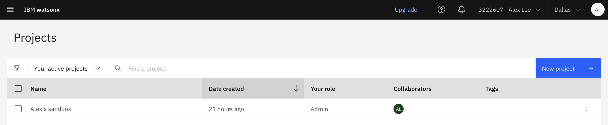
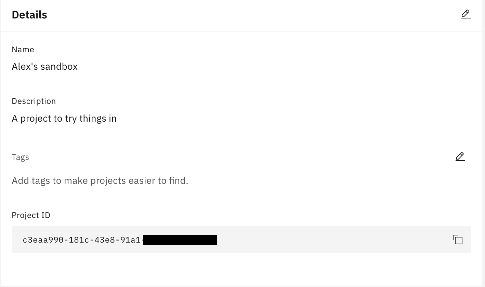
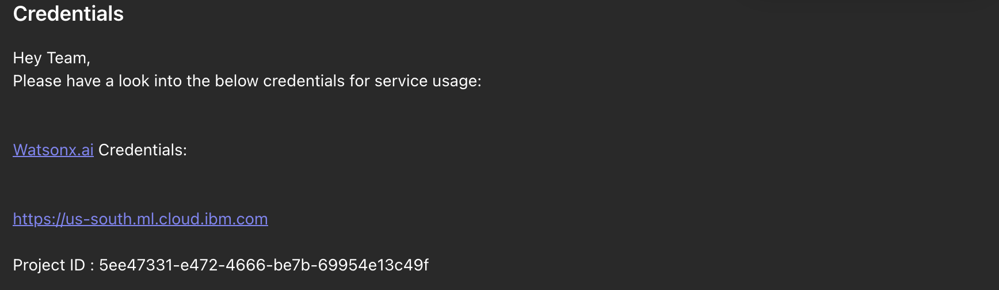
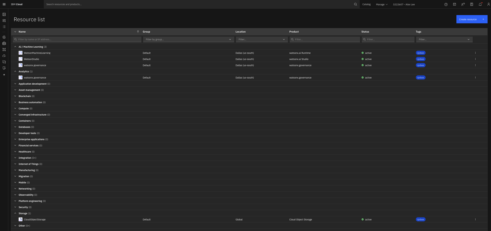
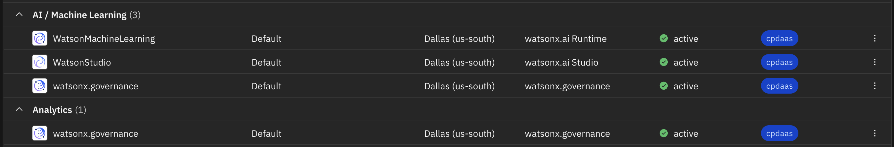
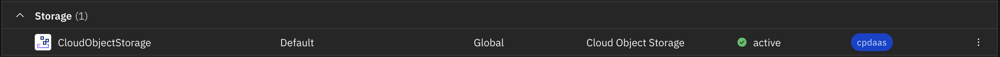
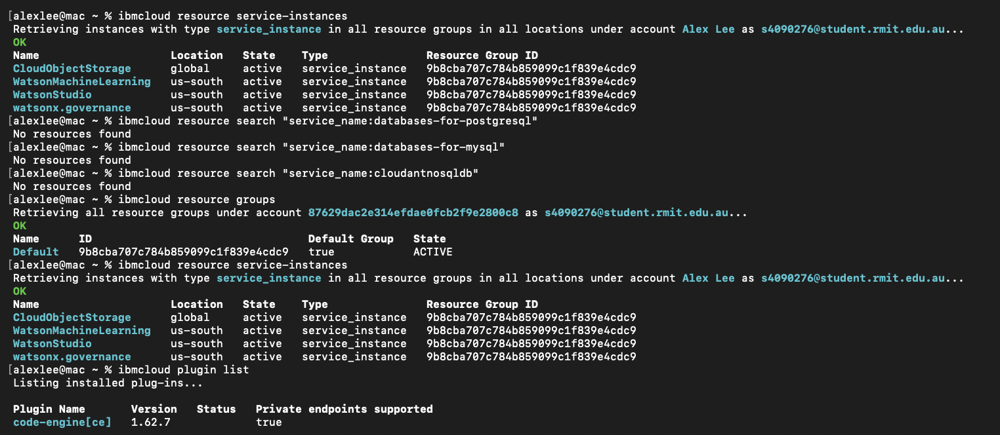

# Initial findings and notes to Project Manager and Developer 2
Introduction: The Project Manager, Dat Nguyen Minh, and the Second Developer, Kai Lek Kum, have been informed at an earlier date due to the lateness of task completion with the teams update post listed below. A more comprehensive update log is listed below the teams chat screenshot.


**Notes to Dat Nguyen Minh[PM]:**
- Inform Naresh that project and given model catalogs aren't accessible in watsonx.ai
- Not sure whether you should do so, feels like me not properly researhing what to do
- I will inform you later if I find a solution to said watsonx.ai problem at a later date.

**Notes to Kai Lek Kum[Dev2]:**
- Check if project access to watsonx.ai API works for yourself, to do so, login to watsonx.ai, then on project lists, if project is available, click on the project --> "Manage" menu on top menu bar --> Look at "Details" in "General" to verify if "Project ID" is the same as Naresh's provided ID **5ee47331-e472-4666-be7b-69954e13c49f**
- Commands to gain and confirm access via **terminal commands(MacOS):**
- **NOTE:** *Remember to log your YOUR_ACCESS_TOKEN*
- *IBM Cloud Terminal Installation*
```
curl -fsSL https://clis.cloud.ibm.com/install/osx | sh
ibmcloud --version
```
- *IBM Cloud login(email and password)/(website link and one time token access)*
```
ibmcloud login
ibmcloud login --sso
```
- *Check for access request success(http 200)/failure(http 401, 403, 404, etc.) and model catalog:*
```
curl -s -o /dev/null -w "HTTP Status: %{http_code}\n" \
  "https://us-south.ml.cloud.ibm.com/ml/v1/foundation_model_specs?version=2024-05-01" \
  -H "Authorization: Bearer YOUR_ACCESS_TOKEN"

curl -s \
  "https://us-south.ml.cloud.ibm.com/ml/v1/foundation_model_specs?version=2024-05-01" \
  -H "Authorization: Bearer YOUR_ACCESS_TOKEN" \
  | jq -r '.resources[].model_id'
```
- *Confirm ProjectID is correct, should see something like[ "project_id": "5ee47331-e472-4666-be7b-69954e13c49f", ]*
```
 curl -i -X POST \ 
  "https://us-south.ml.cloud.ibm.com/ml/v1/text/chat?version=2024-05-01" \
  -H "Authorization: Bearer YOUR_ACCESS_TOKEN" \    
  -H "Content-Type: application/json" \
```

# IBM TechZone/Sandbox login test
Introduction: Although IBM TechZone/Sandbox was successfully verified, it took a while to successfully confirm whether IBM cloud access was conducted successfully due to a discrepency with MacOS terminal and watsonx.ai website project catalog. When the terminal was identified to be the best way to access said model catalog, TechZone/Sandbox were able to be conducted through the terminal with little problems.

Initial login test to the given project in watsonx.ai yielded surprising results. Upon creation and login of developer's email(s4090276@student.rmit.edu.au), the expected project wasn't found in projects list, dispite being added via stakeholder Naresh; although through running **command:**
``` curl -s \
"https://us-south.ml.cloud.ibm.com/ml/v1/foundation_model_specs?version=2024-05-01" \
-H "Authorization: Bearer [generated token access]" \
| jq -r '.resources[].model_id'
```


The project and following model catalogs are accessible by this user:

The most surprising aspect upon testing login validation in MacOS terminal was when running **command:**
'''
ibmcloud login
'''


That the password validation failed although this developer has checked multiple times that the inputted password is correct, therefore was forced to attempt login with a one time access token running which was successful; **command:**
'''
ibmcloud login --sso
'''


Sandbox was then confirmed accessible with **command:**
```
ibmcloud target
ibmcloud resource groups
ibmcloud target -g Default
ibmcloud target
```


# Available project list identified:
Introduction: Project list was done without much issue, and is actually viewable in the IBM cloud website. All models provided by Naresh(IBM) was available for further analysis and review.

In the terminal it's viewable when logged in with **command:**
```
ibmcloud resource service-instances
```


# IBM Code Engine availability check
Introduction: IBM code engine availability wasn't available within the project's plugin list and was completely empty. It required running pluigin installations to install IBM code engine to the project, however upon installation, plugin is now available.

In the terminal, I've checked initial availability via **command:**
```
ibmcloud plugin list
ibmcloud resource service-instances
```


Installed IBM Code Engine via **command:**
```
ibmcloud plugin repo-plugins
ibmcloud plugin install code-engine
```


Final check for IBM Code Engine is viewing its listed available Projects(Since IBM Code Engine has just been installed, expected result is an empty list with no errors); **command:**
```
ibmcloud ce project list
ibmcloud target -g ce 
ibmcloud plugin list
```


# Relevant storage services identified
Introduction: Initial relevant storage services identified and already installed to the project is the IBM's cloud-object-storage[cos], while other services have been identified but have not been installed yet as the task only specified to identify relevant storage services, however, PM or Dev2 can install them if they choose so.

Check for relevant storage service and inspect it.
**command:**
```
ibmcloud plugin list
ibmcloud resource search "service_name:cloud-object-storage"
```


Highlighting relevant storage services:
**command:**
```
ibmcloud plugin repo-plugins
ibmcloud resource search "service_name:cloud-object-storage"
```
**Screenshot:**


# Relevant database options identified
Introduction: No relevant or any database services were installed within the project, however there was one IBM plugin that was available for download. Action to download isn't conducted yet.

**command:**
```
ibmcloud resource service-instances
ibmcloud resource search "service_name:databases-for-postgresql"
ibmcloud resource search "service_name:databases-for-mysql"
ibmcloud resource search "service_name:cloudantnosqldb"
```


Identified uninstalled Database plugins listed below:
**command:**
```
ibmcloud plugin repo-plugins
```



# Missing access/blockers documentation
Introduction: The biggest access problems identified, which has resulted in a delay in the completion of this Developer's assigned task and severe confusion is the lack of access to the project within IBM's watsonx.ai website. This might have been due to the inexperience in working with IBM's architecture, however access has been achieved with the less intuitive MacOS terminal which shows this Developer's access to the project and models, allowing the eventual completion of this task. The main issue though is **listed below:**

Website vs MacOS Terminal:
| **watsonx.ai Project List** | **IBM Cloud Project List** | **MacOS Terminal Project List** |
| --- | --- | --- |
|    |    | |

Blockers Table:
| **Blockers** | **Impact** | **Screenshot** | **Status[Completed/Incomplete]** |
| University watsonx.ai project does not appear in the web UI's
Projects list despite successful API access using the supplied
Project ID. | --- |  | Incomplete |
| Inital terminal login issues with email and password option | --- |  | Incomplete |
| Only I seem to have access to the project? | --- |  | Incomplete |

Project access attempt history logs.
**Tuesday:(18/08/2026)**
- Initial investigation into Project and model catalog, mainly relying on watsonx.ai and IBM Cloud website API
- Couldn't find project via both websites


**Wednesday:(19/08/2026)**
- Investigation with ChatGPT yielded possible access via Terminal
- Installed IBM Cloud in terminal
**command:**
```
ibmcloud plugin repo-plugins
```
- All attempts to rectify terminal and watsonx.ai discrepency failed to yield any results, attempts conducted include.
- *Verifying correct account(s4090276@student.rmit.edu.au) was used*
**command:**
```

```

- *Verifying if IBM has correctly assigned project and catalog to said email*

**command:**
```

```
- *Attempting to update watsonx.ai*
**command:**
```

```


- Procastinated a lot but laid the foundations for completion tomorrow
- Informed PM and Dev2 relevant informations

**Thursday:(20/08/2026)**
- Finalising findings and updating findings


# ChatGPT logs and AI transparency
Introduction: This assigned task required the used of AI to debug and problem solve why watsonx.ai couldn't find the models, and identifying all necessary and required terminal commands to complete said task and confirm alignment with task requirements. The link to the AI chatbot is listed **here:** [ChatGPTLogs](https://chatgpt.com/share/6a8653f0-6664-83ec-8a0a-a6b0f5aa0f16)

# GitHub .md Format Guide
[GitHubMDFormatGuide](https://docs.github.com/en/get-started/writing-on-github/getting-started-with-writing-and-formatting-on-github/basic-writing-and-formatting-syntax)
