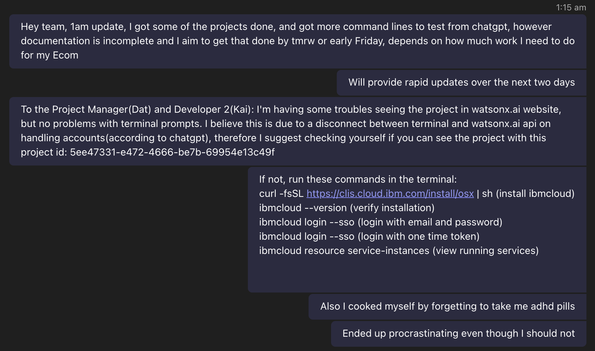
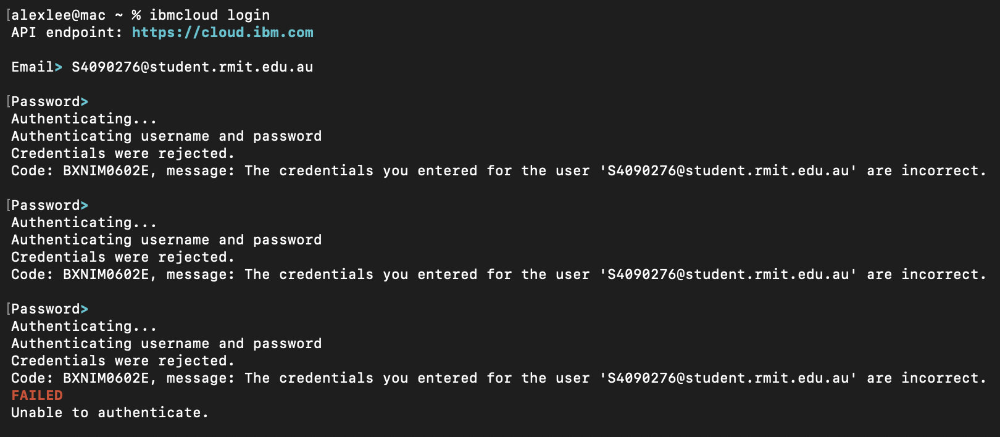
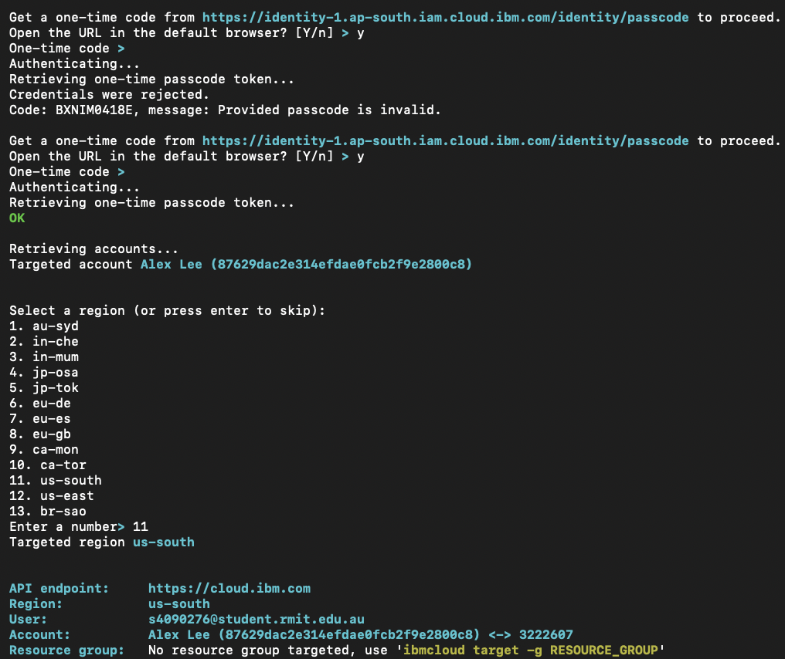
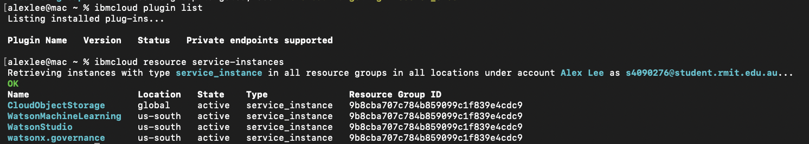
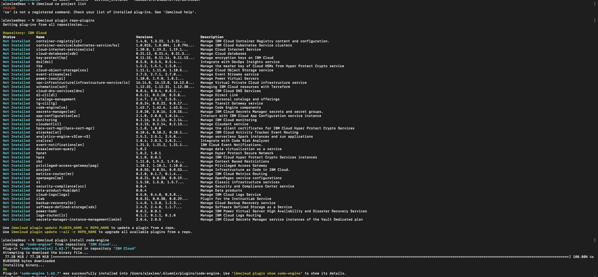
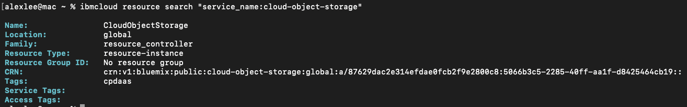
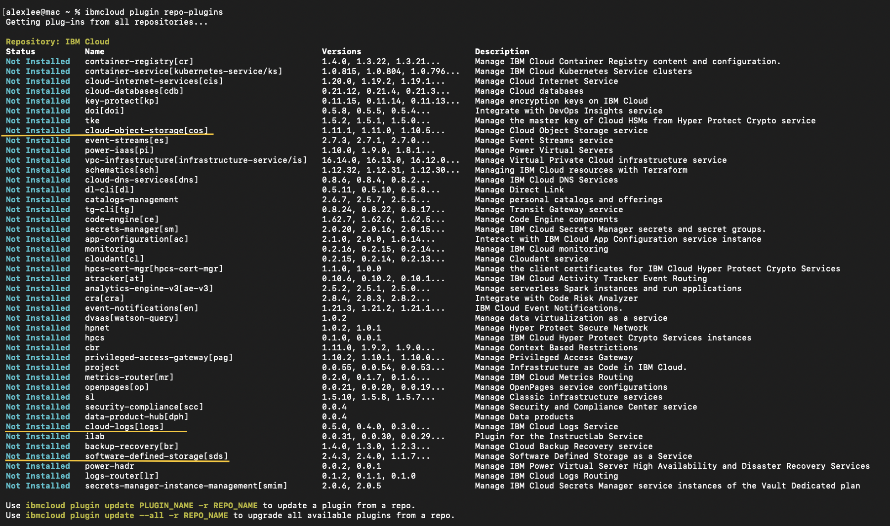
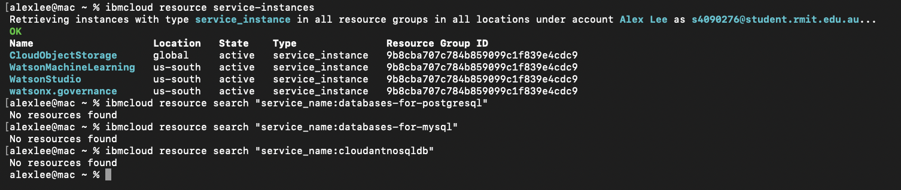

# Initial findings and notes to Project Manager and Developer 2
Project Manager

**Screenshot:**


# IBM TechZone/Sandbox login test
Introduction: Although IBM TechZone/Sandbox was successfully verified, it took a while to successfully confirm whether IBM cloud access was conducted successfully due to a discrepency with MacOS terminal and watsonx.ai website project catalog. When the terminal was identified to be the best way to access said model catalog, TechZone/Sandbox were able to be conducted through the terminal with little problems.

Initial login test to the given project in watsonx.ai yielded surprising results. Upon creation and login of developer's email(s4090276@student.rmit.edu.au), the expected project wasn't found in projects list, dispite being added via stakeholder Naresh; although through running **command:**
``` curl -s \
"https://us-south.ml.cloud.ibm.com/ml/v1/foundation_model_specs?version=2024-05-01" \
-H "Authorization: Bearer [generated token access]" \
| jq -r '.resources[].model_id'
```
**Screenshot:**


The project and following model catalogs are accessible by this user:

The most surprising aspect upon testing login validation in MacOS terminal was when running **command:**
'''
ibmcloud login
'''
**Screenshot:**


That the password validation failed although this developer has checked multiple times that the inputted password is correct, therefore was forced to attempt login with a one time access token running which was successful; **command:**
'''
ibmcloud login --sso
'''
**Screenshot:**


Sandbox was then confirmed accessible with **command:**
```

```
**Screenshot:**

# Available project list identified:
Introduction: Project list was done without much issue, and is actually viewable in the IBM cloud website. All models provided by Naresh(IBM) was available for further analysis and review.

In the terminal it's viewable when logged in with **command:**
```
ibmcloud resource service-instances
```
**Screenshot:**


# IBM Code Engine availability check
Introduction: IBM code engine availability wasn't available within the project's plugin list and was completely empty. It required running pluigin installations to install IBM code engine to the project, however upon installation, plugin is now available.

In the terminal, I've checked initial availability via **command:**
```
ibmcloud plugin list
ibmcloud resource service-instances
```
**Screenshot:**


Installed IBM Code Engine via **command:**
```
ibmcloud plugin repo-plugins
ibmcloud plugin install code-engine
```
**Screenshot:**


Final check for IBM Code Engine is viewing its listed available Projects(Since IBM Code Engine has just been installed, expected result is an empty list with no errors); **command:**
```
ibmcloud ce project list
ibmcloud target -g ce 
ibmcloud plugin list
```
**Screenshot:**


# Relevant storage services identified
Introduction: Initial relevant storage services identified and already installed to the project is the IBM's cloud-object-storage[cos], while other services have been identified but have not been installed yet as the task only specified to identify relevant storage services, however, PM or Dev2 can install them if they choose so.

Check for relevant storage service and inspect it.
**command:**
```
ibmcloud plugin list
ibmcloud resource search "service_name:cloud-object-storage"
```
**Screenshot:**



Highlighting relevant storage services:
**command:**
```
ibmcloud plugin repo-plugins
ibmcloud resource search "service_name:cloud-object-storage"
```
**Screenshot:**


# Relevant database options identified
Introduction: No relevant or any database services were installed within the project, however there was one IBM plugin that was available for download. Action to download isn't conducted yet.

**command:**
```
ibmcloud resource service-instances
ibmcloud resource search "service_name:databases-for-postgresql"
ibmcloud resource search "service_name:databases-for-mysql"
ibmcloud resource search "service_name:cloudantnosqldb"
```
**Screenshot:**


Identified uninstalled Database plugins listed below:
**command:**
```
ibmcloud plugin repo-plugins
```
**Screenshot:**


# Missing access/blockers documentation
Introduction: The biggest access problems identified, which has resulted in a delay in the completion of this Developer's assigned task and severe confusion is the lack of access to the project within IBM's watsonx.ai website. This might have been due to the inexperience in working with IBM's architecture, however access has been achieved with the less intuitive MacOS terminal which shows this Developer's access to the project and models, allowing the eventual completion of this task. The main issue though is **listed below:**

Website vs MacOS terminal
**Screenshot:**

**Screenshot:**


**Blocker:**
University watsonx.ai project does not appear in the web UI's
Projects list despite successful API access using the supplied
Project ID.
**Screenshot:**


**Impact:**
No impact on programmatic model access. Foundation model discovery
and inference have been successfully tested through the watsonx.ai
API.
**Screenshot:**


**Status:**
Web UI project visibility unresolved.
**Screenshot:**


**Initial access attempt on Tuesday:**

# Missing access/blockers documentation
Introduction: This assigned task required the used of AI to debug and problem solve why watsonx.ai couldn't find the models, and identifying all necessary and required terminal commands to complete said task and confirm alignment with task requirements. The link to the AI chatbot is listed **here:** 
