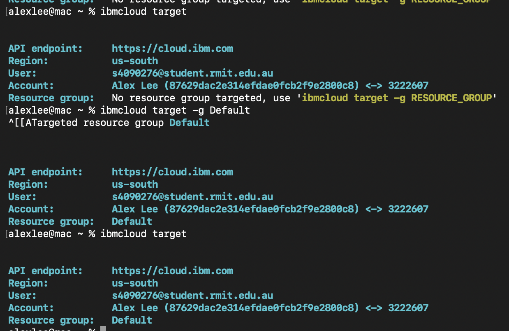
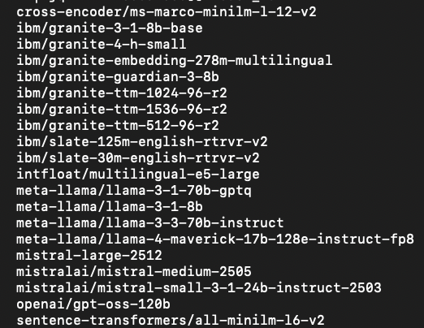
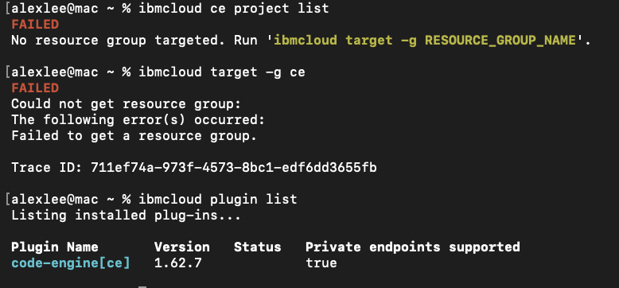

# Initial findings and notes to Project Manager and Developer 2
Introduction: Upon updating our client Naresh from IBM, it appears that he "forgot" to send the link although apprarently he stated that we didn't fully check every avilable channel to access the project and model catalogs. However, it seems that after resending the project, we have now actually gotten the projects. Moreover, we can now access it via the websites of watsonx.ai, IBM Cloud and IBM Techzone. This will also mean that this ammendment will not contain any terminal code since there is no need to have terminal code due to the easier access and management on IBM's website

**Notes to Dat Nguyen Minh[PM]:**
- Thank you for contacting Naresh about our access problems
- Solution is already present.

**Notes to Kai Lek Kum[Dev2]:**
- Help me figure out how to properly research and validate models and. architectures.
- My main way before is throwing stuff at the wall and seeing what sticks.

# IBM TechZone/Sandbox login test
Introduction: It appears that we can now see the entire catalog's

Sandbox was then confirmed accessible with **command:**
```
ibmcloud target
ibmcloud resource groups
ibmcloud target -g Default
ibmcloud target
```


# Available project list identified:
Introduction: Project list was done without much issue, and is actually viewable in the IBM cloud website. All models provided by Naresh(IBM) was available for further analysis and review.



# IBM Code Engine availability check
Introduction: IBM code engine availability wasn't available within the project's plugin list and was completely empty. It required running pluigin installations to install IBM code engine to the project, however upon installation, plugin is now available.



# Relevant storage services identified
Introduction: Initial relevant storage services identified and already installed to the project is the IBM's cloud-object-storage[cos], while other services have been identified but have not been installed yet as the task only specified to identify relevant storage services, however, PM or Dev2 can install them if they choose so.

Check

# Relevant database options identified
Introduction: No relevant or any database services were installed within the project, however there was one IBM plugin that was available for download. Action to download isn't conducted yet.

# Permissions Check
Introduction: No relevant or any database services were installed within the project, however there was one IBM plugin that was available for download. Action to download isn't conducted yet.

# Missing access/blockers documentation
Introduction: The biggest access problems identified, which has resulted in a delay in the completion of this Developer's assigned task and severe confusion is the lack of access to the project within IBM's watsonx.ai website. This might have been due to the inexperience in working with IBM's architecture, however access has been achieved with the less intuitive MacOS terminal which shows this Developer's access to the project and models, allowing the eventual completion of this task. The main issue though is **listed below:**


# ChatGPT logs and AI transparency
Introduction: This assigned task required the used of AI to debug and problem solve why watsonx.ai couldn't find the models, and identifying all necessary and required terminal commands to complete said task and confirm alignment with task requirements. The link to the AI chatbot is listed **here:** [ChatGPTLogs](https://chatgpt.com/share/6a8653f0-6664-83ec-8a0a-a6b0f5aa0f16)

# GitHub .md Format Guide
[GitHubMDFormatGuide](https://docs.github.com/en/get-started/writing-on-github/getting-started-with-writing-and-formatting-on-github/basic-writing-and-formatting-syntax)
