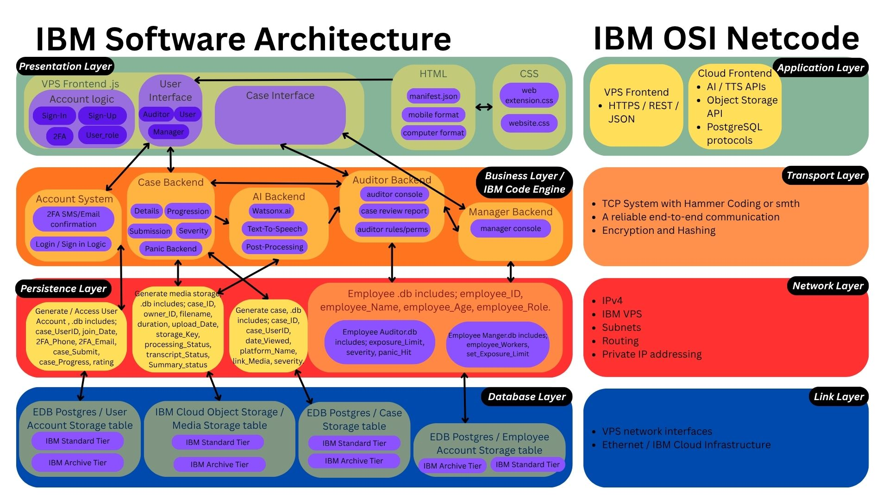

# Overall Architecture Design

# Description

## Presentation Layer / VPS
- **Account Logic:** Where users, auditors and managers initially sign-in / log-in, two-factor authentication frontend and setting up user roles.
- **User Interfaces:** Unique interfaces for Users, Auditors and Managers roles, what their frontends will look like.
- **Case Interface:** What submitting the media cases will look like
- **HTML:** Dictates the initial website frontend layouts; Manifest.json is for web extension, mobile and computer formatting for compatibility with expected user devices.
- **CSS:** Further formatting of the website layouts.

## Business Layer / IBM Code Engine
- **Account System:** Manages the logic for the account system, mainly two-factor authentication, sign-in and log-in logic, session details, e.t.c. Communicates with Account Logic frontend and Generate / Access User Account persistence layer.
- **Case Backend:** Manages cases, mainly things like case progression, case details, case severity, case submission, auditor and user exposure / panic logic. Communicates with User Interface frontend and Generate / Access Media  and Case Database persistence layer. 
- **AI Backend:** Manages the watsonx.ai processing logic, text-to-speech and video processing logic. Communicates with Case Backend and Generate / Access Case Database persistence layer.
- **Auditor Backend:** Manages the logic for the auditor system, mainly auditor console logic, case review report and tracking their exposure limits. Communicates with User and Case Interface frontend and Generate / Access Employee Database persistence layer.
-**Manager Backend:** Manages the logic for the manager system, mainly manager consoles. Communicates with User and Case Interface frontend and Generate / Access Employee Database persistence layer.

## Persistence Layer
- **Generate / Access User Account:** Generates initial SQL structure of user including user_ID, join_Date, 2FA_Phone, 2FA_Email, case_Submit, case_Progress, rating. Case Backend, Account System and Auditor Backend mainly communicate and append updates here which will pass it down to the Database Layer. Users who haven’t logged in a year will have their account information moved to the Archive Tier in the Database Layer until requested to move back to the Standard Tier.
- **Generate / Access Media Database:** Generates initial SQL structure for video media including  case_ID, owner_ID, file_Name, storage_Key, processing_Status, file_AI_Processed_Visual, file_AI_Processed_Audio, transcript_Status, Summary_status. This handles storage of the original video media file, the AI post editing of the file, including video and audio edits, timestamps, transcripts, AI summary. Case and AI backends mainly communicate and append updates here which will be passed down to the Database Layer. Video media that hasn’t been revisited a few years later by auditors / managers will be automatically moved to the Archive Tier in the Database Layer if not done manually unless auditors / managers consciously decide to move it back to the Standard Tier.
- **Generate / Access Case Database:** Generates initial SQL structure for cases including, case_ID, user_ID, date_Viewed, platform_Name, link_Media, severity_Rating, file_Duration, upload_Date. This handles a case’s metadata, and doesn’t store the actual video metadata. However, it stores the . Case, Auditor and Manager backends mainly communicate and append updates here which will be passed down to the Database Layer. Case metadata that hasn’t been revisited a few years later by auditors / managers will be automatically moved to the Archive Tier in the Database Layer if not done manually unless auditors / managers consciously decide to move it back to the Standard Tier.
- **Generate / Access Employee Database:** Generates initial SQL structure of general employee_ID, employee_Name, employee_Age, employee_Role. There are two sub-tables within the Employee database called and stores Auditor Database:  case_IDs, exposure_Limit, severity, panic_Hit_Count; and Manager Database: case_IDs, employee_Workers_IDs. employee_Workers_Names, set_Exposure_Limit, set_Severity_Limit, panic_Hit_Limit. Auditor’s case exposure limits are set by the Managers and they store the case_IDs that they worked on, Managers also store the case_IDs that they worked on as well as any Auditors that they currently manage. Any former Auditors and Managers will have their metadata moved to the Archive Tier unless they re-join the program. 

## Database Layer
### EDB Postgres
- **User / Account database table:** Where the actual user metadata is stored.
- **Employee database table:** Where both auditors and managers metadata is stored
- **Case Table:** Where the actual case metadata is stored.

### IBM Cloud Object Storage
- **Media Storage Table:** Where the original and AI processed video, associated metadata and AI transcript, summaries, timestamps and others are stored.

## Architecture Assumptions
This architecture assumes some general knowledge / familiarity with VPS and IBM Cloud Engine architecture. Moreover, this simplified model assumes that hardware and software networking works 100% and doesn’t label any error pathways. Finally, it assumes that the AI is trained and working at 100% as expected from stakeholder requirements, for video analysis, transcription, timestamps and notes, and stores the relevant data without error. 

# Notes to PM and Dev2
- **Notes to Project Manager(Dat):** Present this architecture solution to the stakeholder for any comments and seek approval, as well as what they want to see in the final Sprint1 report.
- **Notes to Developer 2(Kai):** Review this architecture solution and scrutinise it for any flaws and missing detail. Cross review AI and STT placements and dependencies, see whether it is integrated into the architecture solution well.

