# Introduction
This documentation will cover five topics. Errors encountered(fixed / documented), MVP implementation for cases, auditor case retrieval, and final human decision persistence errors encountered in wee 2 E2E, and testing IBM services, mainly COS runtime, deployment and limitations, and AI results(integrating Dev2's watsonx.ai and STT work into this project) 

# Week 2 E2E Errors Reproduced, Fixed or Documented
| Error[Document, fixed, broken] | Steps to reproduce, cause | Fixed / Documented |
| --- | --- | --- |
| Submission page crash[Document] | Just enter the page |  |
| Submission page crash[fix] | Removed '!' in backend/IBM_src/case.js function createCase(), file.mimetype.includes(allowed_Format_Video) reading valid file type as negatifalseve | 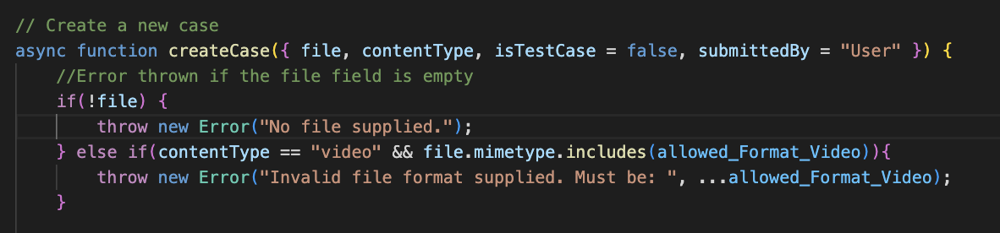 |
| Valid submission read as invalid [fix] | Submitting mp4 doesn't work | 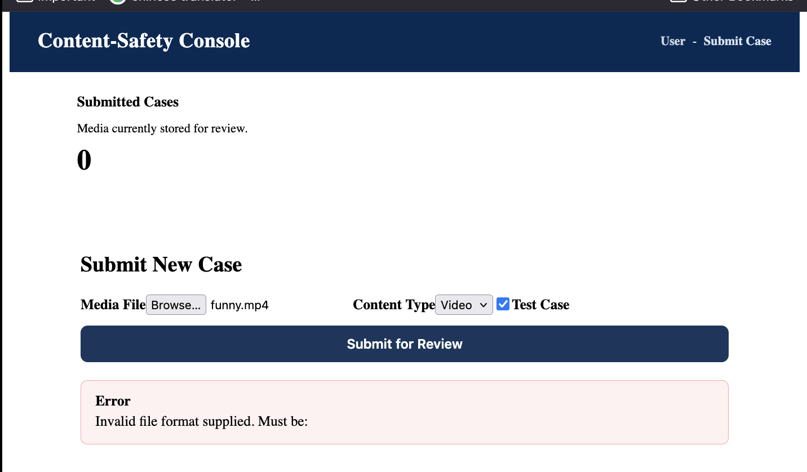 |
| Duplicate submissions[Documented] | Just submit the same thing twice | 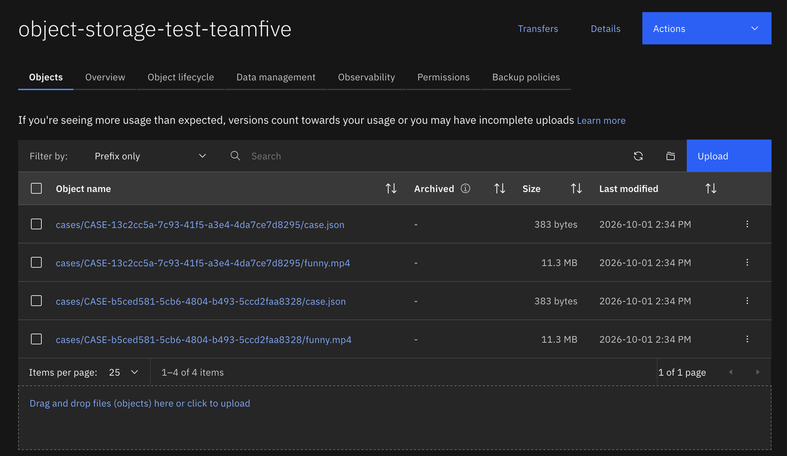 |

# Submission -> Case Creation, Case Persistence and Retrieval Verified
Verified and confirmed with application + IBM COS console
- Submission proof
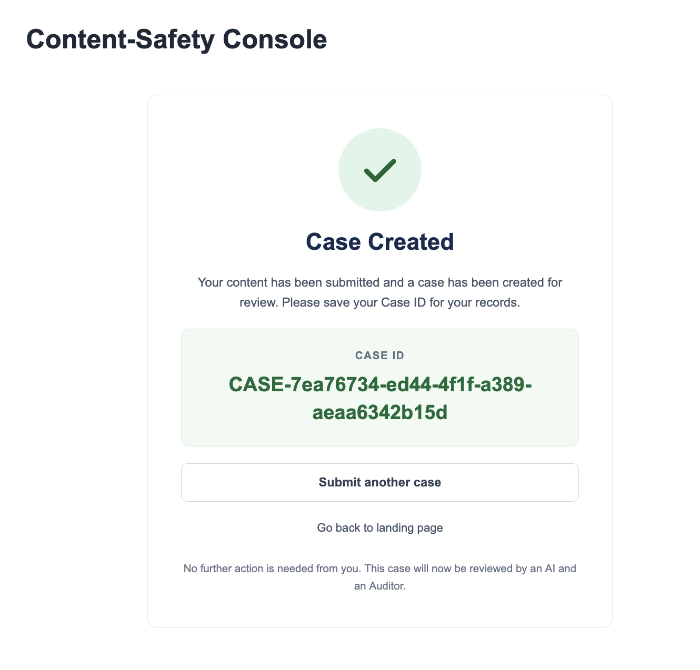
- Case creation proof(Check IBM COS Console)
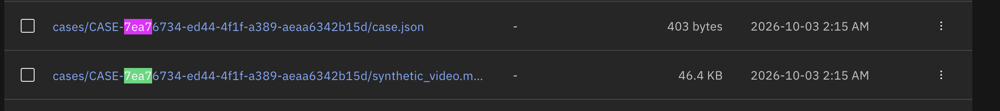
- Case persistence proof
**Json**
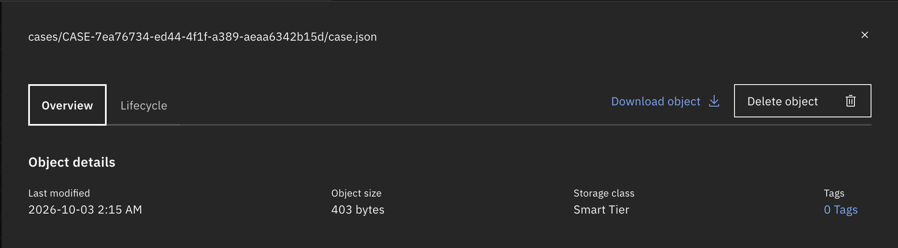
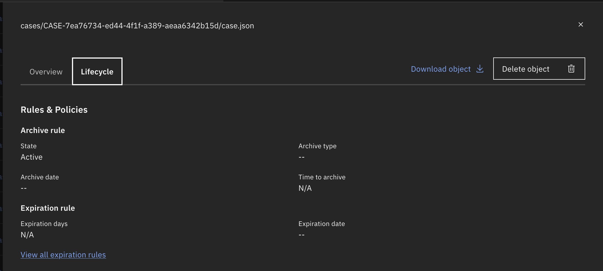
**Video**
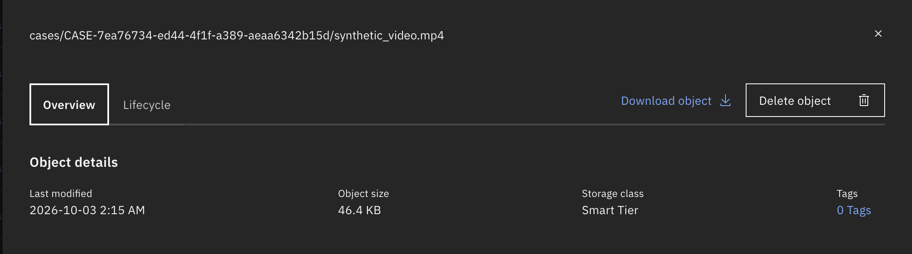
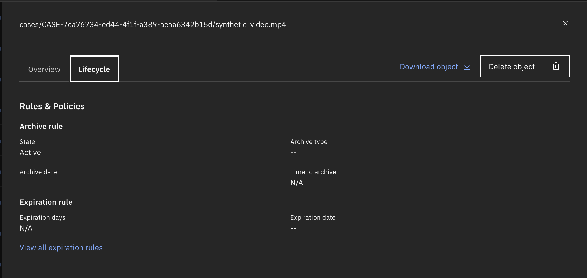
- Retrieval verified in Auditor Console
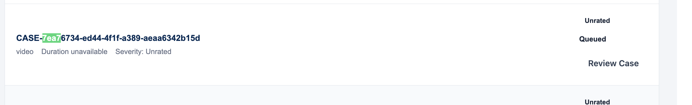

# Auditor UI Receives Correct Case Result
Auditor can receive cases in IBM COS, but cannot get specific cases, assigned to them from the manager, since Manager workflow MVP isn't implemented yet
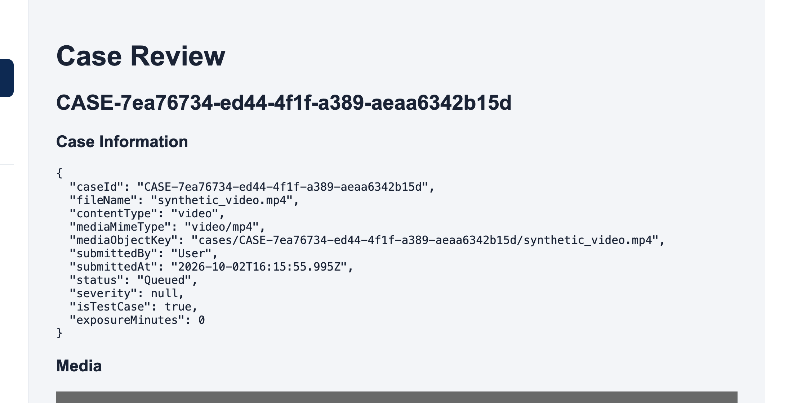
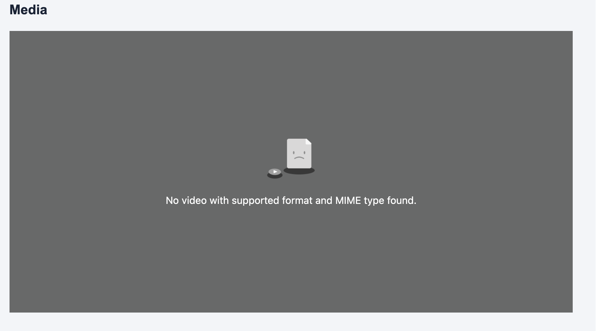

# IBM COS / Runtime / Deployment Path Verified or Limitations Recorded
- **NOTE:** Not all MVP features were fully developed when testing this, especially auditor editing and final human decision persistence, and following UX elements
- Testing with: http://localhost:8080/api/storage-test, we can see that IBM COS Runtime and deployment path is verified, as well as with the above case submission proving that IBM COS servicc implementation is working as expected. However, a possible limitation is that case retrieval cannot pull videos and display it(however that feature hasn't been worked on yet).
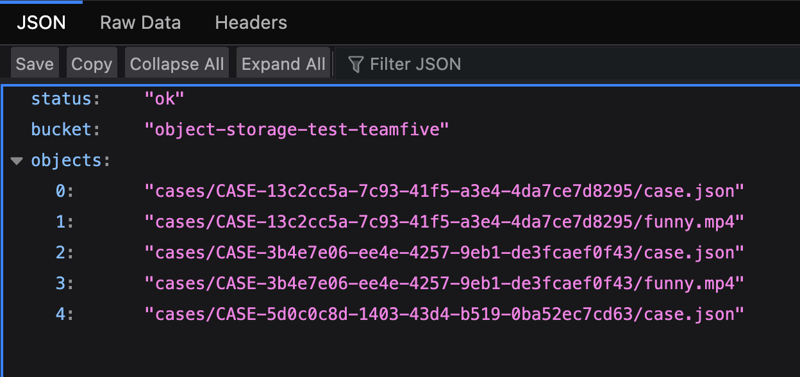

# Final Human Decision Persistence Verified
- Need to create menu items regarding timestamps, showing AI transcript
- Need to intergrate AI transcript in there
- 67
- Not done yet

# Dev2 AI Result Retrieval 
- Haven't verified yet

# Synthetic E2E Run Completed and Evidence Captured
- I'm confused what this means

# Plan
- Test on actual code engine
