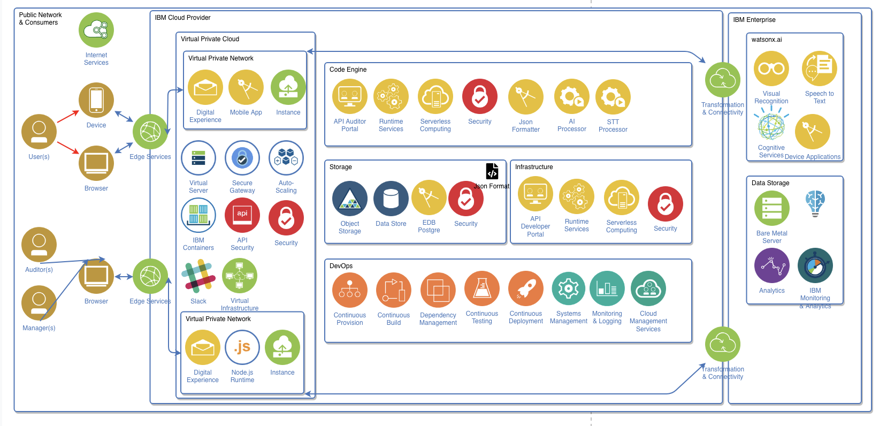

# Minimal Viable Product
## Summary
In this section we're analysing whether the Software Architecture is compatible with the MVP specified from the Business Analyst() and UX Designer(). In depth we're covering:
- Stakeholder Needs: What are their needs?
- Essential MVP functions
- Validation Table:
- Dependencies Table
- Inconsistencies and Resolutions

The most important stakeholder the MVP is pleasing is the Auditor, and it's main purpose is to demonstrate that AI can assist Auditors in conducting their tasks while keeping the final decisions to a human.

## Stakeholder Needs: 
| Stakeholders | Needs | Implication to Architecture | 
| --- | --- | --- |
| Auditors | Can access submitted cases | IBM Code Engine |
| Auditors | Review AI outputs and ammend them | application, IBM Code Engine |
| Auditors | Makes the final decision in the case | IBM Code Engine, authentication |
| Users | Submit Cases | VPC+VPS, IBM Code Engine |
| Users | Receives CaseID and progress | VPC+VPS, IBM Code Engine, watsonx.ai |
| Managers | Track Auditor Exposure | IBM Code Engine, authentication |
| Managers | Track Auditor Workload | IBM Code Engine, authentication |
| Managers | Track Auditor Wellbeing | IBM Code Engine, authentication |

## Essential MVP Functions:
The most important part of the MVP is to demonstrate whether AI can:
- Process approved test content.
- Produce useful structured information.
- Support severity, summary and incident identification.
- Reduce unnecessary direct exposure of Auditors to potentially distressing content.
- Assist rather than replace the Auditor's judgement.

Core MVP flow:
Content submission → Case creation → AI video/audio analysis → Structured outputs → Auditor review → Final review decision

| Stakeholder | User Flow |
| --- | --- |
| Auditors | Access case -> View pre-exposure information -> Review severity / summary / timestamps -> Choose whether targeted media review is needed -> View necessary content(if needed) -> Make final human decision |
| Users | Content submission -> Content Received -> Case Created -> CaseID displayed |
| Managers | Access oversight view -> Review relevant case status -> Review Auditor workload -> Review wellbeing information -> Identify concerns / follow-up |

## Software Architecture - MVP Inconsistencies and Resolutions
Validation Table:
| Classification | Explanation |
| --- | --- |
| Supported | Fully confirmed and tested |
| Partial | Fully confirmed but not tested |
| None | Not confirmed nor tested|

| MVP Requirement | Software Architecture Component | Validation | Depencencies | Inconsistency | Resolution |
| --- | --- | --- | --- | --- | --- |
| SOS / Panic exposure button | VPC / VPS, Code Engine | Partial | Application | Not explicitly defined within the software design | Include a specific SOS / Panic button component within the software design |
| Auditors can access case | VPC / VPS, Code Engine | Supported | Application isn't configured and confirmed | Auditor flow isn't clearly defined in the architecture | Clarify auditor's flow within the software architecture diagram |
| Auditors review AI outputs and ammend them | VPC / VPS, Code Engine | Partial | None | None | Not necessary |
| Auditor makes final decision | VPC / VPS, Code Engine, Database Services | Supported | None | None |  Not necessary |
| User submits case(s)[video / audio] | VPC / VPS, Code Engine, Database Services | Supported | None | None | Not necessary |
| User receives CaseID and progress | VPC / VPS, Code Engine, Database Services | None | None | None |  Not necessary  |
| Manager tracking auditor exposure | VPC / VPS, Code Engine | None | None | Better showcase of manager flow in Architecture | Include separated rows and columns to showcase manager and other stakeholder flows |
| Manager tracking auditor workload | VPC / VPS, Code Engine | None | None | Better showcase of manager flow in Architecture | Include separated rows and columns to showcase manager and other stakeholder flows |
| Manager tracking auditor wellbeing | VPC / VPS, Code Engine | None | None | Better showcase of manager flow in Architecture | Include separated rows and columns to showcase manager and other stakeholder flows |
| AI video processing | watsonx.ai / WML, Object Storage | Supported | Json innput and storage | Dependencies not accounted for in original design | A translator component in IBM Code Engine to take into account dependency |
| Audio / STT processing | IBM STT, Object Storage | Supported | Json input and storage | Dependencies not accounted for in original design |  A translator component in IBM Code Engine to take into account dependency |
| Database storage | Code Engine, EDB Postgre | Partial | Json structure | Underdeveloped, not in Json format | Refine storage related components with stronger sub-components and explanations |

# Developer 2(Kai Lek Kum) Flow Validation
## Summary
In this section we're exploring whether Dev2's AI and STT flow architecture is compatible. In depth we're analysing:
- Visual Architecture
- Valitation Table of each component's: Steps, Inputs, Outputs, Architectue Components, Status.
- Dependencies Table of each component's:
- Inconsistencies and Resolutions

## AI / STT Flow
Content Input(Video authentication) -> AI / STT Processing(Transcribe, then analyse) -> Structured Result(Json output) -> Backend(Storage)

## Validation Table
| Steps | (1) Content Input | (2) AI/STT Processing | (3) Structured Result | (4) Backend |
| --- | --- | --- | --- | --- |
| Input | Video and Audio | Video and Audio | Processed Video and Audio, STT transcript | AI results and OG case |
| Output | Upload Video and Audio | Process video and audio with AI, transcribe with STT | Convert to Json format and match dependencies | Store cases |
| Architecture Component(s) | Application/VPS | IBM watsonx.ai, WML, IBM STT | IBM Code Engine | Object Storage, EDB Postgre |
| Status | Unready | Ready | Ready | Unready | 

## Software Architecture - AI / STT Flow Inconsistencies and Resolutions
Validation Table:
| Classification | Explanation |
| --- | --- |
| Supported | Fully confirmed and tested |
| Partial | Fully confirmed but not tested |
| None | Not confirmed nor tested |

| AI / STT Flow Requirement | Software Architecture Component | Validation | Depencencies | Inconsistency | Resolution |
| --- | --- | --- | --- | --- | --- |
| API Key authentication | .env, IBM MFA and Security App? | Partial | None | Not shown in Software Architecture | Component added and explained in final software architecture schematics |
| STT basic authentication | .env | Partial | None | Not shown in Software Architecture | Component added and explained in final software architecture schematics |
| AI IAM bearer token | .env, | Supported, doesn't exist yet | None | Not shown in Software Architecture | Component added and explained in final software architecture schematics |
| Json output, generated text | watsonx.ai | None | None | Not shown in Software Architecture | Component added and explained in final software architecture schematics |
| Transcribe_confidence | IBM STT | None | None | Not shown in Software Architecture | Component added and explained in final software architecture schematics |
| Auditor interface | VPC / VPS, Code Engine, Authentication | Supported | None | Not shown in Software Architecture | Component added and explained in final software architecture schematics |

# Finalised Architecture Plan
## Visual Architecture Plan(To use by PM in slides)

## Architectural Assumption
- Data is stored in Json format specified by the Dev2 documentation
- Architecture fufills MVP specifications only
- All blockers are resolved

## IBM Technical Stuff
| Object / Bucket | Role / Placement |
| --- | --- |
| Code Engine | Runs critical backend logic, such as connecting user requests to relevant IBM services such as watsonx.ai |
| Object Storage | Holds the orignal and ai processed video and audio of cases |
| EDB Database | Holds all data that can be stored in Json, which means any data that can be represented as a string, float, integer and / or boolean |
| STT model | Converts case audio into words, identifies languages of harm and censors them, stores them in EDB Database |
| Watsonx.ai | Analyses and summarises video content with STT model for speech analysis, identifies timestamps, censors video at timestamps, transcribes, stores video and audio in EDB Database |

# Playback Preparations(To use by PM in slides)
The chosen design decisions were made to implement MVP and AI / STT flow with mininal cost, ease of implementation and allocation of tasks, while keeping the solution expandable with cloud services such as VPS, and secure with cybersecurity principles implemented.

| Decisions | Why? | Blockers |
| --- | --- | --- |
| Separate Users and Auditors + Managers | Better security, implementing Separation of Privilege | None |
| VPC and VPS | Better scalability, increase and decrease servers based on region and demand | None |
| Code Engine Frontend API | Scalability | None |
| Code Engine Backend API | Scalability | None |
| EDB PostgresSQL and Object Storage | Saves on resources, only video and audio needs to be stored as an object, EDB handles data that can be represented with a Json format as a dependency identified by Dev2 | None |

# Sources
[Chatgpt_Logs](https://chatgpt.com/share/6aa21479-abc4-83ec-a835-508a2618795)