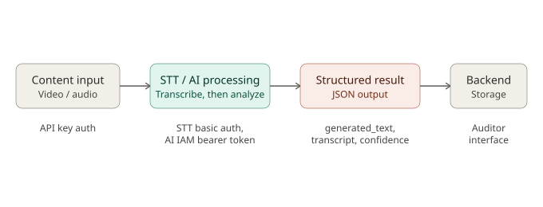

What to do:
- Review Architecture and finer details
- Confirm all assumptions are correct
- Confirm Code Engine Role
- Confirm Storage Role
- Confirm database direction
- SST placement
- Watsonx.ai Placement

Check
- Dev2 flow consistency check
- Aut/security considerations reviewed: What are the threat? What are the options to counter?
- Human final decisions represneted?
- Confirm all environmental dependencies documented?

Prepare for PM
- Playback architecture visuals: Make a new better, cleaner, more IBM like architectural visual.
- All evidence shared with PM

Goal:
Validate that the IBM architecture actually supports the Core MVP and Dev2 AI/STT flow, identify anything missing or inconsistent, document the decisions/blockers, and provide clear evidence for PM playback.

# Minimal Viable Product
## Summary
In this section we're analysing whether the Software Architecture is compatible with the MVP specified from the Business Analyst() and UX Designer(). In depth we're covering:
- Stakeholder Needs: What are their needs?
- Essential MVP functions
- Validation Table:
- Dependencies Table
- Inconsistencies and Resolutions

The most important stakeholder the MVP is pleasing is the Auditor, and it's main purpose is to demonstrate that AI can assist Auditors in conducting their tasks while keeping the final decisions to a human.

## Stakeholder Needs: 
| Stakeholders | MVP Requirement | Implication to Architecture | 
| --- | --- | --- |
| Auditors | Can access submitted cases | IBM Code Engine |
| Auditors | Review AI outputs and ammend them | application, IBM Code Engine |
| Auditors | Makes the final decision in the case | IBM Code Engine, authentication |
| Users | Submit Cases | VPC+VPS, IBM Code Engine |
| Users | Receives CaseID and progress | VPC+VPS, IBM Code Engine, watsonx.ai |
| Managers | Track Auditor Exposure | IBM Code Engine, authentication |
| Managers | Track Auditor Workload | IBM Code Engine, authentication |
| Managers | Track Auditor Wellbeing | IBM Code Engine, authentication |

## Essential MVP Functions:
The most important part of the MVP is to demonstrate whether AI can:
- Process approved test content.
- Produce useful structured information.
- Support severity, summary and incident identification.
- Reduce unnecessary direct exposure of Auditors to potentially distressing content.
- Assist rather than replace the Auditor's judgement.

Core MVP flow:
Content submission → Case creation → AI video/audio analysis → Structured outputs → Auditor review → Final review decision

| Stakeholder | User Flow |
| --- | --- |
| Auditors | Access case -> View pre-exposure information -> Review severity / summary / timestamps -> Choose whether targeted media review is needed -> View necessary content(if needed) -> Make final human decision |
| Users | Content submission -> Content Received -> Case Created -> CaseID displayed |
| Managers | Access oversight view -> Review relevant case status -> Review Auditor workload -> Review wellbeing information -> Identify concerns / follow-up |

## Validation Table
| MVP Requirement | Required Architecture Capability | Current Architecture Component | Validation | Notes |
| --- | --- | --- | --- | --- |

## Dependencies Table
| MVP Function | Dependency | Architecture Component | Required Configuration / Access | Status |
| --- | --- | --- | --- | --- |

## Software Architecture - MVP Inconsistencies and Resolutions
| Inconsistency | Current Architecture | MVP Requirement | Impact | Resolution |
| --- | --- | --- | --- | --- |

# Developer 2(Kai Lek Kum) Flow Validation
## Summary
In this section we're exploring whether Dev2's AI and STT flow architecture is compatible. In depth we're analysing:
- Visual Architecture
- Valitation Table of each component's: Steps, Inputs, Outputs, Architectue Components, Status.
- Dependencies Table of each component's:
- Inconsistencies and Resolutions

## AI / STT Flow

## Validation Table
| Steps | (1) Content Input | (2) AI/STT Processing | (3) Structured Result | (4) Backend |
| --- | --- | --- | --- | --- |
| Input | Video and Audio | Video and Audio | Processed Video and Audio, STT transcript | AI results and OG case |
| Output | Upload Video and Audio | Process video and audio with AI, transcribe with STT | Convert to Json format and match dependencies | Store cases |
| Architecture Component(s) | Application/VPS | IBM watsonx.ai, WML, IBM STT | IBM Code Engine | Object Storage, EDB Postgre |
| Status | Unready | Ready | Ready | Unready | 

## Dependencies Table

## Software Architecture - AI / STT Flow Inconsistencies and Resolutions
| Inconsistency | Current Architecture | AI / STT Flow Requirement | Impact | Resolution |
| --- | --- | --- | --- | --- |

# Architecture Review
## Overall Architecture

## Architectural Assumption

## Architectural Roles and Placement
| Object / Bucket | Role / Placement |
| --- | --- |
| Code Engine | |
| Object Storage | |
| EDB Database | |
| STT model | |
| Watsonx.ai | |

## Network Check

# Security and Access

# Decisions & Dependencies

# Playback Preparations(To use by PM in slides)

# Sources
